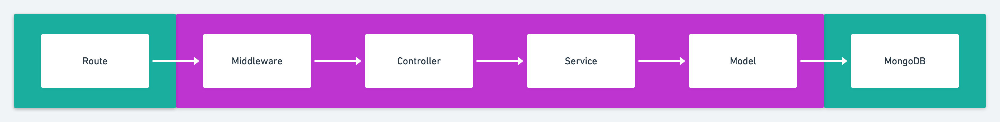

# Testing Express REST API

## Key takeaways
* An understanding of how important testing is
* Testing doesn't have to be complicated or difficult

## What will you learn?
* Testing a REST API end-to-end with Supertest & mongodb-memory-server
* Mocking services
* Testing from the controller to the service

Read: https://github.com/goldbergyoni/javascript-testing-best-practices

## What you will need
* Clone this repository: https://github.com/vikashparida1995/express-testing-api.git
* An IDE or text editor (VS Code)
* A package manager such as NPM or Yarn
* Node.js installed

## Data flow

